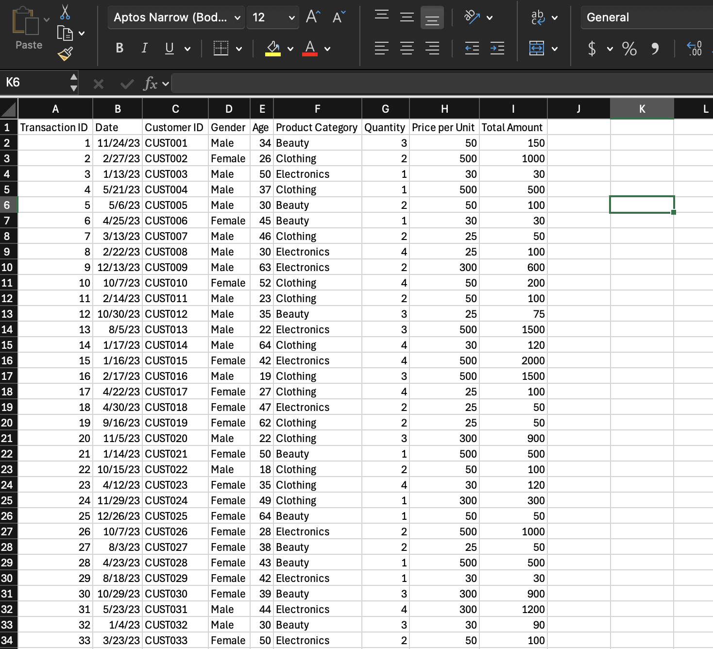

# 📊 Retail Sales Dashboard (Excel)

## 📌 Project Overview
This project analyzes a retail transactions dataset and visualizes monthly revenue trends across product categories.  
The goal was to build an interactive Excel dashboard that helps users quickly identify top-performing categories, seasonal patterns, and customer trends using PivotTables, PivotCharts, and slicers.

---

## 🎯 Business Questions Answered
- Which product category generates the most revenue?
- Which months had the highest and lowest total sales?
- How does performance vary across categories over time?
- Can revenue trends be explored by customer demographics (Gender)?

---

## 🛠 Tools Used
- **Microsoft Excel**
  - Data Cleaning & Formatting  
  - PivotTables  
  - PivotCharts  
  - Slicers (Interactive Filters)

---

## 📂 Dataset Columns
- **Transaction ID**
- **Date**
- **Customer ID**
- **Gender**
- **Age**
- **Product Category**
- **Quantity**
- **Price per Unit**
- **Total Amount**

---

## ✅ Steps Performed

### 1️⃣ Data Preparation
- Verified column formatting (especially Date)
- Confirmed revenue calculations (Total Amount)
- Cleaned and structured dataset for pivot analysis

📌 **Raw Dataset**

---

### 2️⃣ PivotTable Creation (Revenue by Month & Category)
Created a PivotTable to summarize total revenue by:
- **Rows:** Product Category  
- **Columns:** Months (grouped from Date)  
- **Values:** Sum of Total Amount  

📌 **PivotTable**

---

### 3️⃣ PivotChart Visualization
Converted the PivotTable into a PivotChart to compare categories and monthly revenue patterns.

📌 **PivotChart**

---

### 4️⃣ Dashboard + Slicers (Interactivity)
Added slicers so users can instantly filter the dashboard by:
- Product Category
- Month
- Gender

📌 **Dashboard with Filters**

---

## 📌 Key Insights
- **Electronics generated the highest total revenue overall**, making it the top-performing category.
- **February and May showed peak revenue**, indicating seasonal spikes.
- **September had the lowest revenue**, suggesting a slowdown period.
- Slicers make it easy to explore category performance and customer trends quickly.

---

## ✅ Final Dashboard
📌 **Final Excel Dashboard View**

---

## 📈 Skills Demonstrated
- Data analysis in Excel  
- PivotTables & PivotCharts  
- Interactive dashboard design  
- Business insight generation  
- Trend & category performance analysis  

---

## 📌 How to Use
1. Download the Excel file from the `/excel` folder  
2. Open it in Excel  
3. Use slicers to filter by category, gender, or month  
4. Review pivot insights and charts

---

## 🔗 Files Included
- `/data/retail_sales_dataset.csv`
- `/excel/retail_sales_dashboard.xlsx`
- `/screenshots/` (project screenshots)

---

## 👤 Author
**Manveer Grewal**  
📫 Email: manveer.g65@gmail.com  
🔗 LinkedIn: *(add your link here)*
